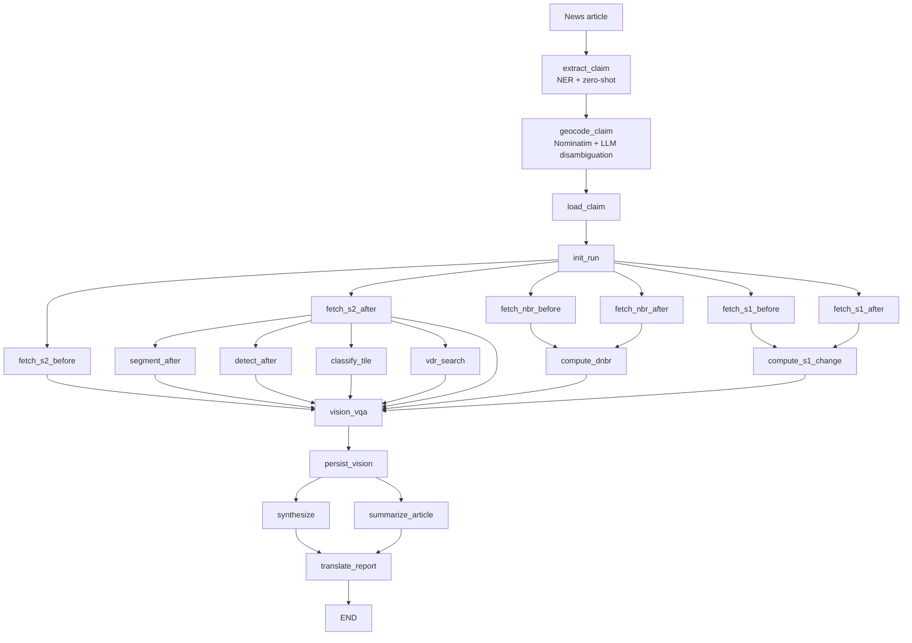

# Beacon — Multimodal Geospatial Event Verification

[](https://github.com/abdllahx/beacon/actions/workflows/test.yml)

A production-grade agent system that detects claims in global news (natural disasters, conflict events, deforestation, humanitarian crises) and autonomously verifies or refutes them by cross-referencing recent satellite imagery, producing cited, evidence-backed verification reports.

**Closes the loop:** *claim → geolocation → imagery diff → grounded report.*

Today this work is a slow mix of manual OSINT (Bellingcat-style) and unreliable text-only LLMs that hallucinate coordinates. Beacon does it in minutes, with a multimodal evidence stack you can audit.

---

## What it does

```
news article → NER + relevance filter → geocoder (LLM-disambiguated)
              → Sentinel-2 + Sentinel-1 SAR before/after
              → NBR/dNBR + SAR-change + SegFormer + DETR + SigLIP
              → Claude vision verdict + BART summary + multilingual report
```

All composed as a **21-node LangGraph DAG with SQLite checkpointing** so any run is resumable.

## 9 HuggingFace tasks composed end-to-end

The original Beacon spec called for 9 distinct HF tasks "genuinely composed, not bolted on." Every task below fires on every run and persists results into the database — provable from the verification dashboard, not just claimed in a README.

| HF Task | Model | Where it runs | Persists into |
|---|---|---|---|
| Token Classification (NER) | `Davlan/bert-base-multilingual-cased-ner-hrl` | `extract_claim` node | `claims.locations` |
| Zero-Shot Text Classification | `facebook/bart-large-mnli` | `extract_claim` node | `claims.event_type` |
| Sentence Similarity | `sentence-transformers/all-MiniLM-L6-v2` | `embed-claims` CLI | `claims.embedding` (pgvector 384) |
| Summarization | `facebook/bart-large-cnn` | `summarize_article` node | `verification_runs.article_summary` |
| Translation | `Helsinki-NLP/opus-mt-en-{es,ar,fr}` | `translate_report` node | `verification_runs.translations` |
| Image Segmentation | `nvidia/segformer-b0-finetuned-ade-512-512` | `segment_after` node | `imagery_metadata.s2.after.segmentation` |
| Object Detection | `facebook/detr-resnet-50` | `detect_after` node | `imagery_metadata.s2.after.detections` |
| Zero-Shot Image Classification | `google/siglip-base-patch16-224` | `classify_tile` node | `imagery_metadata.s2.after.zero_shot` |
| Visual Document Retrieval | `google/siglip-base-patch16-224` (image+text embeddings) | `vdr_search` node | `imagery_metadata.vdr_matches` (pgvector 768) |

Plus **Claude Sonnet via the Agent SDK** for the high-level vision VQA + verification synthesizer.

## Architecture



The full DAG (`uv run beacon graph-render`) has **21 nodes** with **6-way parallel imagery fetch** + **4-way parallel vision-task fan-out**.

## Stack

| Layer | Choice | Why |
|---|---|---|
| Orchestration | LangGraph + SqliteSaver checkpointer | Branching retries, resumable runs |
| Storage | Postgres 16 + PostGIS 3.5 + pgvector 0.8 | Hybrid geo + dense retrieval, single store |
| Imagery | Microsoft Planetary Computer (Sentinel-2 L2A + Sentinel-1 RTC) | Free, anonymous-readable STAC |
| Ground truth | NASA FIRMS + EM-DAT (CRED) + GDIS (Rosvold & Buhaug 2021) + ACLED (loader shipped, awaits API tier) | Triangulated; GDIS is peer-reviewed; ACLED OAuth flow validated end-to-end pending researcher tier approval |
| LLM planner/synthesizer | Claude Sonnet via Agent SDK | Available on Max plan, no API budget |
| Vision/text models | 9 HuggingFace tasks (table above) | All via free Inference Providers or local CPU |
| Demo UI | Streamlit | Single-file, all 9 modalities visible |

## Eval methodology (v2 — honest)

The benchmark feeds the pipeline **only synthesized article text** (built from EM-DAT structured fields). Extract → geocode → imagery → vision all run from text alone, and the resulting bbox is compared against **GDIS peer-reviewed centroids** (Rosvold & Buhaug 2021, *Sci. Data*).

We report Accuracy@N km following the geoparsing literature standard (Gritta et al. 2018, *A Pragmatic Guide to Geoparsing Evaluation*) — the percentage of predicted locations within N km of ground truth, at N ∈ {10, 50, 161} km.

See [EVAL.md](EVAL.md) for the full methodology, prior-version critique, and snapshot/diff machinery.

## Demo

5 hand-curated demo events ship with the project:

| Event | Verdict | dNBR burn % | SAR backscatter Δ | SigLIP top class |
|---|---|---:|---:|---|
| 2025 Pacific Palisades Fire | supported (0.85) | 37.7% | -15.0% | "burned land or fire scar" |
| 2024 Park Fire (CA) | supported (0.82) | 19.0% | — | (varies) |
| 2023 Lahaina (Maui) | supported (0.78) | 1.7% | — | (varies) |
| 2023 Donnie Creek (BC) | inconclusive (0.40) | 0% | — | (varies) |
| 2023 Rhodes (Greece) | inconclusive (0.40) | 0% | — | (varies) |

Run the dashboard: `uv run beacon ui` → http://localhost:8501

## Quickstart

```bash
# Prereqs: Docker, uv (https://docs.astral.sh/uv/), a free HuggingFace token, NASA FIRMS key, NewsAPI key.
git clone https://github.com/abdllahx/beacon.git
cd beacon

# Postgres (PostGIS + pgvector — built from db/Dockerfile, arm64-friendly)
docker compose up -d
docker exec -i beacon-db psql -U beacon -d beacon < sql/001_init.sql
# (apply 002–013 likewise)

# Python
uv sync

# Configure .env  (example provided as .env.template)
cp .env.template .env
# edit .env to add HF_TOKEN, NASA_FIRMS_KEY, NEWSAPI_KEY

# Seed demo events + ground truth
uv run beacon demo-seed
uv run beacon firms-load --area "-141,48,-115,60" --days 5
uv run beacon emdat-load
uv run beacon gdis-load

# Run the full pipeline on a demo event
uv run beacon graph-run 11  # claim_id 11 = Palisades

# Open the dashboard
uv run beacon ui
```

## Known limitations (honest)

- **Synthetic benchmark inputs.** Pipeline is benchmarked on text synthesized from EM-DAT structured fields, not real news articles. Real news has 10× richer location context. Real-news scraping is on the Month 3 roadmap.
- **GDIS coverage.** GDIS doesn't include wildfires (only floods, storms, earthquakes, landslides, droughts, volcanic, extreme temperature). Wildfire-specific recall is reported on the demo events, not on GDIS.
- **DETR at 10 m resolution.** COCO-trained DETR finds zero objects on most Sentinel-2 tiles — vehicles and people are sub-pixel. The node is wired and persists results honestly; on sub-meter aerial input the same node produces dense detections.
- **Claude as VLM, not Qwen2.5-VL.** Substituted intentionally (no GPU budget, Max plan covers it). Same pipeline shape; swap the model in `src/beacon/claude.py` if you have GPU.

## Observability + cost + HITL (Month 3)

- **Langfuse Cloud** tracing across the agent DAG — every Claude / HF call wrapped in `@observe`. Activates when `LANGFUSE_*` env vars are set; no-op otherwise. See [observability.py](src/beacon/observability.py).
- **DIY cost log** — every Claude call writes to `cost_events` (operation, model, input/output tokens, latency, USD). Per-operation aggregation surfaces in the Streamlit sidebar and via `uv run beacon cost-report`.
- **Latency stats** — `uv run beacon latency-report` returns p50/p95/p99 wall-clock over completed runs (queried from existing `verification_runs` timestamps; no replay needed).
- **HITL feedback** — analyst confirms or corrects each verdict in the Streamlit dashboard. Writes to the `feedback` table; export with `uv run beacon feedback-export`.
- **DSPy prompt layer** — `dspy.Signature` over the verifier prompt with cached high-quality past runs auto-loaded as few-shot demos. The `BootstrapFewShot` optimizer is wired but deferred until 20+ HITL labels accumulate. See [dspy_synth.py](src/beacon/dspy_synth.py).

See [DEPLOY.md](DEPLOY.md) for the deploy path (Neon + Langfuse + Streamlit Cloud, all free tiers).

## Roadmap

- **Month 1** ✅ — Single-event happy path, 5 hand-picked demos
- **Month 2** ✅ — LangGraph DAG, 9 HF tasks composed, EM-DAT + GDIS + FIRMS eval, Streamlit dashboard
- **Month 3** ✅ — Langfuse tracing, cost log + per-op USD aggregation, latency p50/p95, HITL feedback loop, DSPy prompt skeleton, public deploy via Streamlit Cloud + Neon Postgres
- **Future** — Real-news GDELT benchmark (kills synthetic-text caveat), scale to N=500 GDIS, ACLED tier upgrade for conflict events, active-learning loop

## License

MIT.
